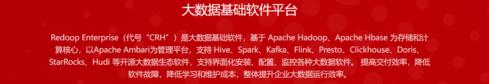

# Redoop Enterprise

&emsp;&emsp;Redoop Enterprise 是专注于Apache Hadoop生态的企业级大数据平台软件,专注于软件交付生命周期中的 安装管理，组件状态维护 , 参数配置 , 运行监控等环节,为企业提供一体化企业级平台软件。  

&emsp;&emsp;Redoop Enterprise 代号 CRH (CHINA REDOOP HYPERLOOP) 寓意”数据高铁”, 代表基于分布式技术的新一代大数据架构。 

&emsp;&emsp;产品由 CRF 数据接入，CRH 数据存储，CRS 数据分析 三大部分构成。为企业提供开放统一的大数据存储和处理环境，产品兼容支持Hadoop生态圈中主要工具，提供PB级海量数据存储、查询、分析和挖掘能力。

&emsp;&emsp;产品从2013年开始持续研发八年，并更新到 V9.0版本，产品支持X86、ARM、OpenPower等国际芯片、同时支持龙芯、飞腾、鲲鹏、海光、申威等信创国产芯片生态,支持麒麟，统信，方德，龙蜥 等操作系统生态，目前已经部署了60多个客户，主要客户是中国航天，服务数十颗大型卫星，管理几十PB数据。

