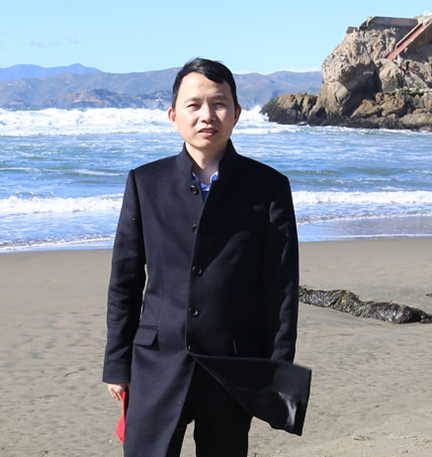
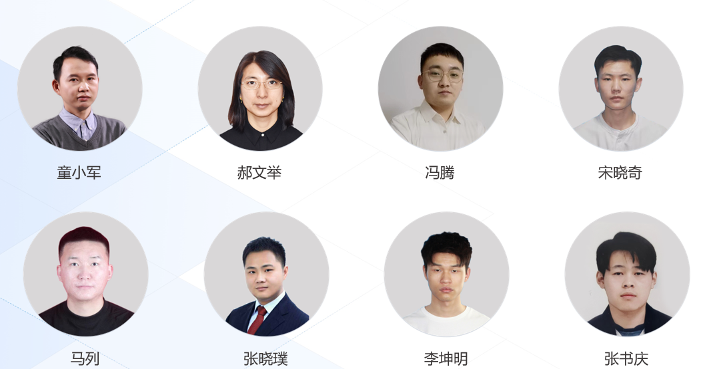

# 团队创始人

## 童小军

+ Cloudera CCDH 中国首个认证工程师，曾任China Hadoop Summit 联合主席。

+ 从事大数据软件研发和培训工作15年,致力于开源和分布式技术普及推广工作。

+ 所研发的 Redoop Enterprise 产品服务60多家大型企业，管理PB规模数据。

# 团队成员

## 郝文举

+ 个人简介

## 冯腾
+ 个人简介

## 宋晓奇
+ 个人简介

## 马列
+ 个人简介

## 张晓璞
+ 个人简介

## 李坤明
+ 个人简介

## 张书庆
+ 个人简介

