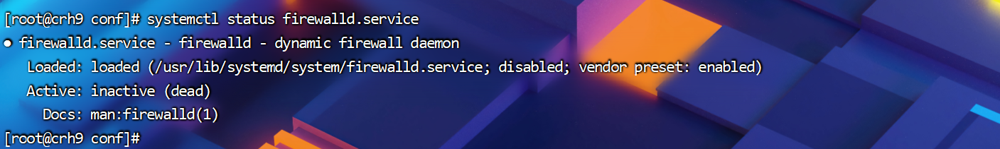
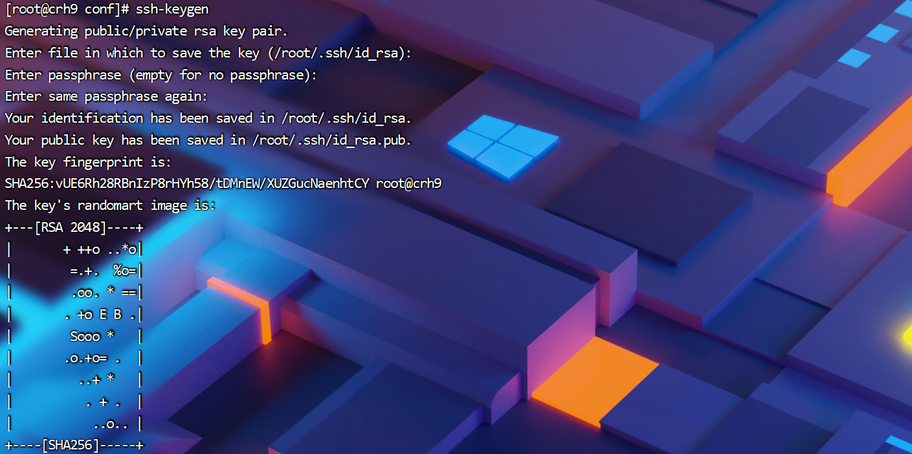
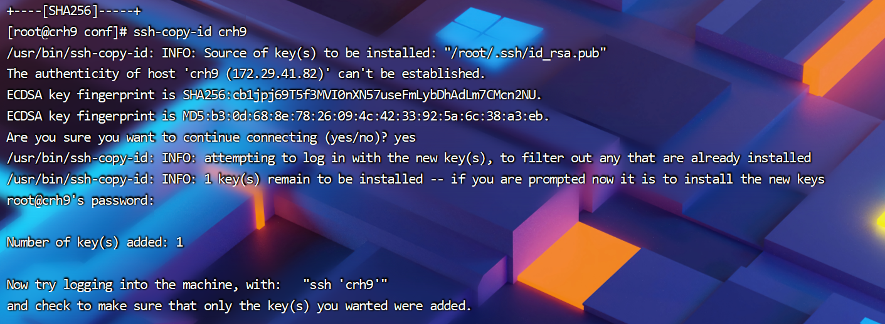

## 环境配置

准备 三台服务器，安装 Centos7.x，RedHat 7.x 操作系统。

### 1. 修改hosts（本集群所有服务器）

```shell
#查看 Hosts
cat /etc/hosts
```

```shell
#修改 Hosts 
vim /etc/hosts


192.x.x.1  master
192.x.x.2  slave1
192.x.x.3  slave2
```


### 2 修改selinux（本集群所有服务器）

```shell
#显示为 SELINUX=disabled 则正确
sudo grep SELINUX=disabled /etc/selinux/config 

#若显示不为disabled，执行以下命令 
sed -i 's/SELINUX=enforcing/SELINUX=disabled/g' /etc/selinux/config
```


### 3 关闭防火墙（本集群所有服务器）

```shell
#查看防火墙状态
systemctl status firewalld.service

```




```shell
#执行后结果
● firewalld.service - firewalld - dynamic firewall daemon
   Loaded: loaded (/usr/lib/systemd/system/firewalld.service; disabled; vendor preset: enabled)
   Active: inactive (dead)
     Docs: man:firewalld(1)

 #说明
“active（running）”				说明防火墙是开启状态
disavtive（dead）				说明防火墙已经关闭 	

```


```shell
#关闭运行的防火墙
systemctl stop firewalld.service

#禁止防火墙服务器
systemctl disable firewalld.service	

```


### 4 配置集群免密登录（本集群Ambari服务器）

```shell
#生成秘钥
ssh-keygen
```


```shell
#复制私钥到其他服务器
ssh-copy-id  master
ssh-copy-id  slave1
ssh-copy-id  slave2
```



