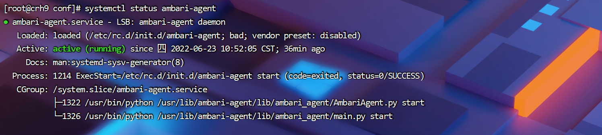

# 前置软件安装

## 1 安装jdk1.8 

+ 本集群所有服务器都需要安装

### 1.1 下载地址

```shell
https://redoop-public-1.oss-cn-beijing.aliyuncs.com/redoop/9.1/x86/tools/jdk/jdk-8u112-linux-x64.tar.gz
```

### 1.2 进入目录opt下载jdk安装包

```shell
cd /opt

# wget 安装包
wget https://redoop-public-1.oss-cn-beijing.aliyuncs.com/redoop/9.1/x86/tools/jdk/jdk-8u112-linux-x64.tar.gz

# 解压缩
tar -zxvf jdk-8u112-linux-x64.tar.gz
# 改名为jdk1.8
mv jdk1.8.0_112/ jdk1.8
# 删除压缩包
rm -rf jdk-8u112-linux-x64.tar.gz 
```

### 1.3 配置环境变量

```shell
#配置环境变量 
vim /etc/profile.d/java.sh 

#添加内容，以自己实际路径为准 
export JAVA_HOME=/opt/jdk1.8 
export JRE_HOME=/opt/jdk1.8/jre
export CLASSPATH=.:$JAVA_HOME/lib:$JRE_HOME/lib:$CLASSPATH 
export PATH=$JAVA_HOME/bin:$JRE_HOME/bin:$PATH 

```

```shell
#使环境变量生效 
source /etc/profile 
```

```shell
#查看是否生效 
java -version

#java version "1.8.0_112" Java(TM) SE Runtime Environment (build 1.8.0_112-b15)
#Java HotSpot(TM) 64-Bit Server VM (build 25.112-b15, mixed mode)
```


## 2 安装HTTP服务 

+ 本集群主节点安装即可（Ambari服务器）

```shell
#安装 httpd 服务
yum install httpd -y

#启动httpd 服务
systemctl start httpd
#检查 httpd 是否启动
systemctl status httpd 
```

## 3 安装mysql

+ 本集群任意节点安装即可

### 3.1 安装包下载

```shell
mysql-community-common-5.7.16-1.el7.x86_64.rpm 
mysql-community-libs-5.7.16-1.el7.x86_64.rpm 
mysql-community-libs-compat-5.7.16-1.el7.x86_64.rpm 
mysql-community-client-5.7.16-1.el7.x86_64.rpm
mysql-community-server-5.7.16-1.el7.x86_64.rpm
```

### 3.2 安装mysql所需依赖项

```shell
sudo rpm -ivh mysql-community-common-5.7.16-1.el7.x86_64.rpm 
sudo rpm -ivh mysql-community-libs-5.7.16-1.el7.x86_64.rpm 
sudo rpm -ivh mysql-community-libs-compat-5.7.16-1.el7.x86_64.rpm 
```

### 3.3 安装mysql-client、server

```shell
sudo rpm -ivh mysql-community-client-5.7.16-1.el7.x86_64.rpm
sudo rpm -ivh mysql-community-server-5.7.16-1.el7.x86_64.rpm
```

如果安装失败，尝试安装以下依赖项

```shell
依赖项
yum install libaio-devel.x86_64
yum install net-tools
yum install numactl-libs.x86_64
```
### 3.4 启动

```shell
# 启动MySQL
sudo systemctl start mysqld

# 查看MySQL密码
sudo cat /var/log/mysqld.log | grep password
```
### 3.5 配置mysql

```shell
# 配置只要是root用户 + 密码，在任何主机上都能登录MySQL数据库。
# 用刚刚查到的密码进入MySQL（如果报错，给密码加单引号）
mysql -uroot -p'password'

# 设置复杂密码（由于MySQL密码策略，此密码必须足够复杂）
set password=password("Qs23=zs32");

# 更改MySQL密码策略
set global validate_password_length=4; 
set global validate_password_policy=0; 

# 设置简单好记的密码
set password=password("123456");

# 进入MySQL库
use mysql;

# 查询user表
select user, host from user;

# 修改user表，把Host表内容修改为%
update user set host="%" where user="root";

# 注意，修改最大连接数
set GLOBAL max_connections=1024; 
show variables like '%max_connections%';
show status like 'Threads%';

# 刷新
flush privileges;

# 退出
quit;
```


## 4 安装ambari-agent

+ 可选择安装或者不安装

```shell
# yum下载ambari-agent
yum install ambari-agent

# 找到ambari-agent配置文件并修改
vim /etc/ambari-agent/confambari-agent.ini
```

+ 将hostname属性设置为主节点主机名


+ 启动amabri-agent

```shell
# 启动agent
systemctl start ambari-agent

# 查看启动状态
systemctl status ambari-agent
```




## 5 安装mysql-connector-java.jar

要在Hive中使用MySQL，您必须[从MySQL ](https://dev.mysql.com/downloads/connector/j/)下载https://dev.mysql.com/downloads/connector/j/

 一旦下载到Ambari服务器主机，运行：

ambari-server setup --jdbc-db=mysql --jdbc-driver=/path/to/mysql/mysql-connector-java.jar

```shell
# 安装mysql-connector-java
yum install mysql-connector-java

# 运行以下
ambari-server setup --jdbc-db=mysql --jdbc-driver=/usr/share/java/mysql-connector-java.jar

```

