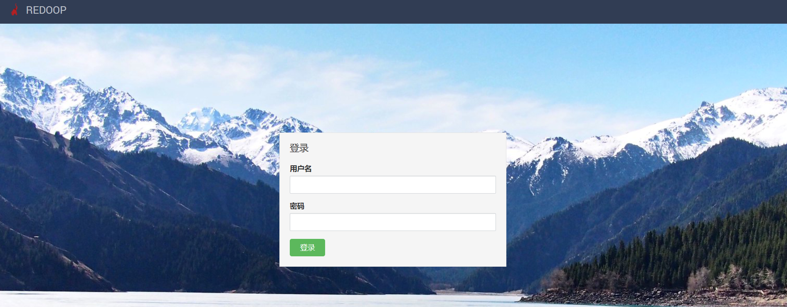
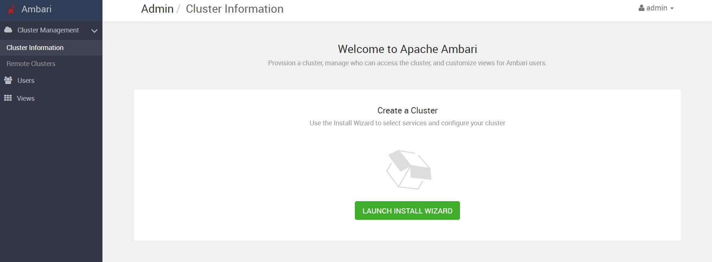
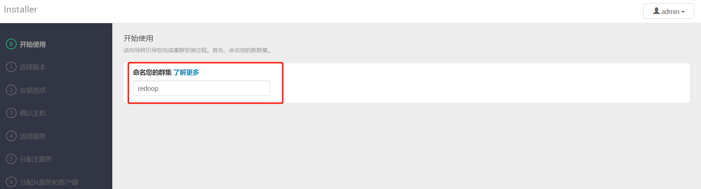
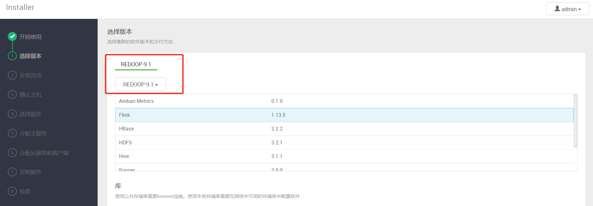
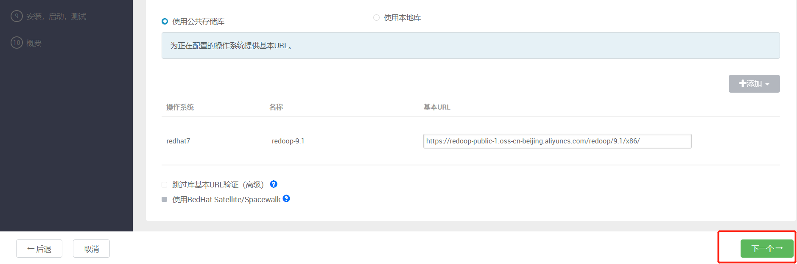
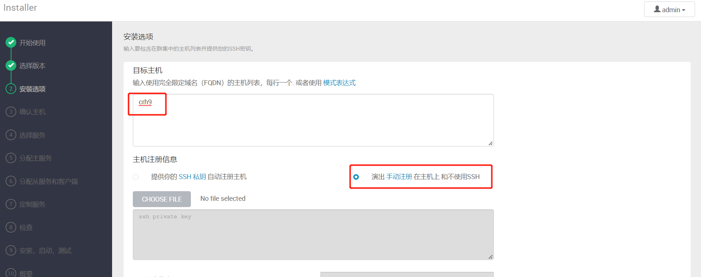
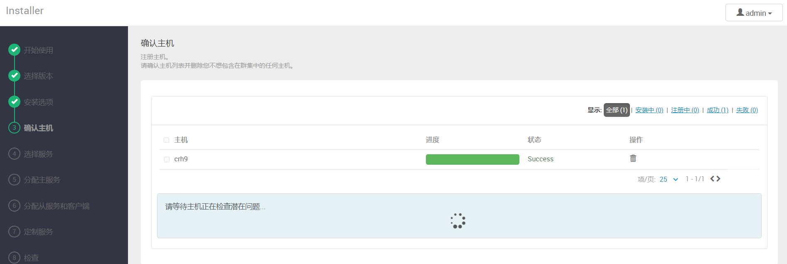
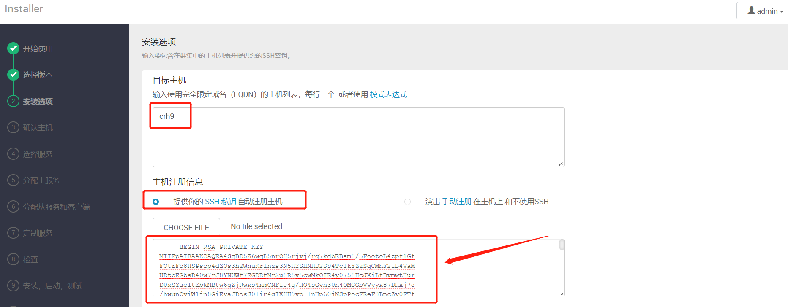
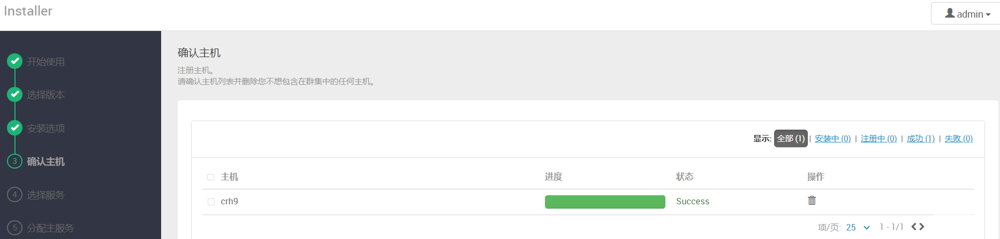

# 登录管理程序

## 1 访问Ambari
+ 打开浏览器
+ 访问主机   http://ip:8080
+ 默认账号：admin  默认密码：admin




启动后创建集群，给自己的集群起一个响亮的名字





选择9.1版本





## 2 首次启动添加集群主机

我们有两种方法可以添加集群主机

| 方法                           | 适用性   |
| ------------------------------ | -------- |
| 1 集群所有机器安装ambari-agent | ☆☆☆      |
| 2 集群所有机器进行ssh免密设置  | ☆☆☆☆☆☆☆☆ |


### 2.1 agent添加主机

如果集群所有主机安装过ambari-agent,我们可以使用如下方法添加主机：

注意：主节点要放在第一行，其他节点放在后面的行，每行一个机器，下一步



注册并确认，下一步，主机注册成功




### 2.2 ssh添加主机

两个方法2选1即可，使用这个方法的前提是配置集群免密登录

```shell
cat /root/.ssh/id_rsa
# 把出现的密钥复制出来粘贴到下图所示文本框中
```



下一步注册机器也可以成功



添加集群的方法以上两种二选一即可，推荐使用ssh免密的方法


至此，集群主机注册成功，下一步就可以在集群上自由的部署组件了

