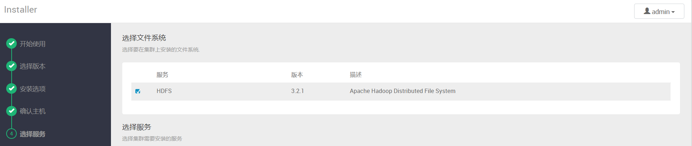
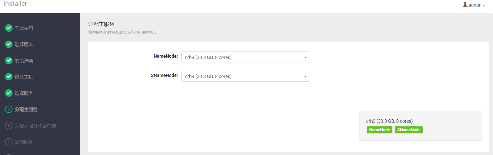
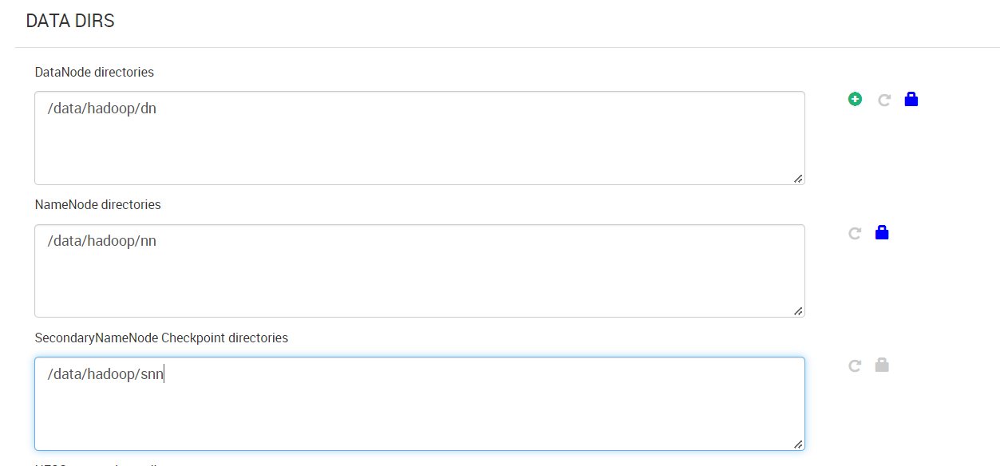
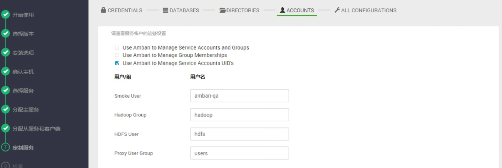
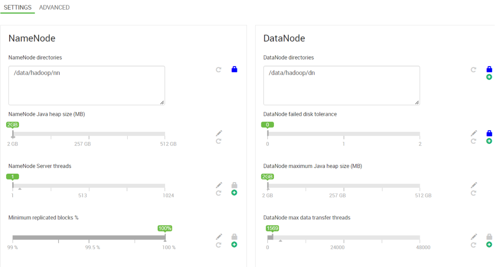
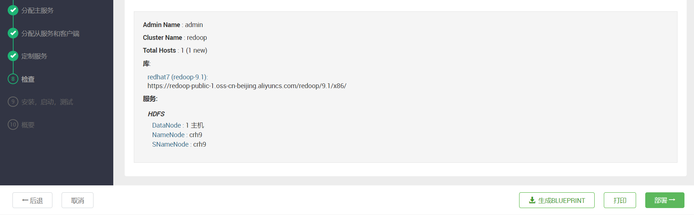
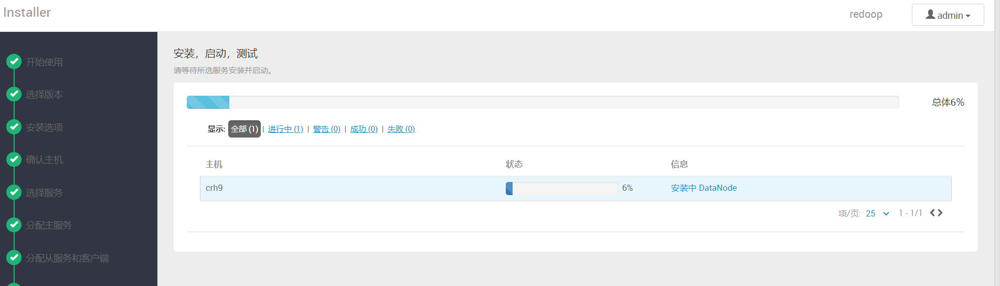
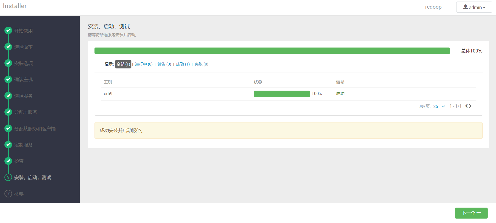

# 部署HDFS

## 1 选择HDFS服务

## 2 分配主从服务

用户按需选择HDFS组件安装的位置即可，下一步

## 3 分配从服务和客户端

将从服务和客户端组件分配给您要运行它们的主机。
显示分配主组件的主机显示*✵*. 即将安装
"客户端" HDFS Client

## 4 分配namenode，snamenode， datanode目录

按需分配 namenode，snamenode， datanode，所在目录，下一步

## 5 设置用户组

用户组按需设置

## 6 分配内存

内存配置按需求配置即可

## 7 一键部署

确认配置无误后，一键部署即可

## 8 完成

下一步，等待安装完成即可

安装完成

完成以后可以在面板查看组件运行情况、也可以进行配置、删除等操作

