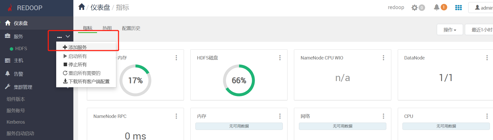
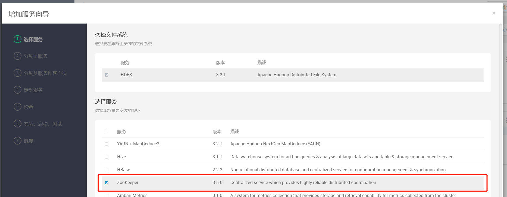
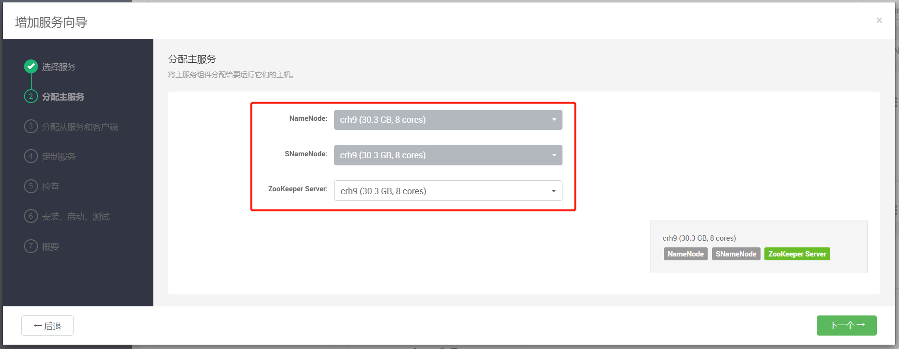
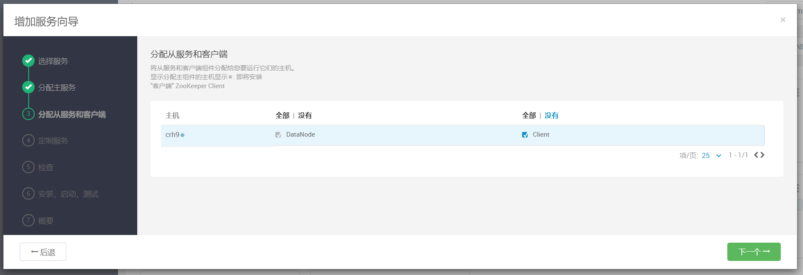
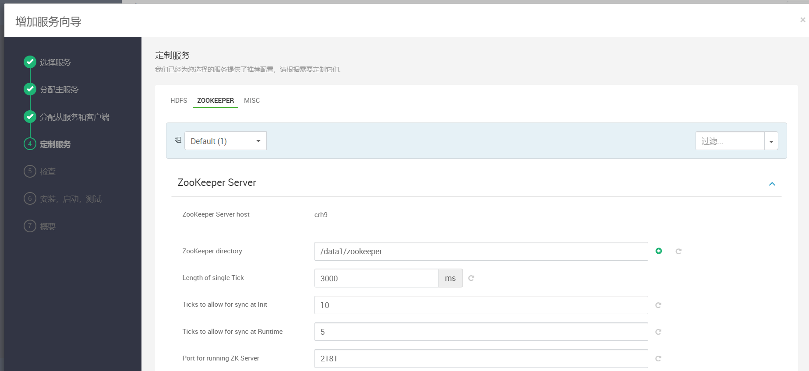
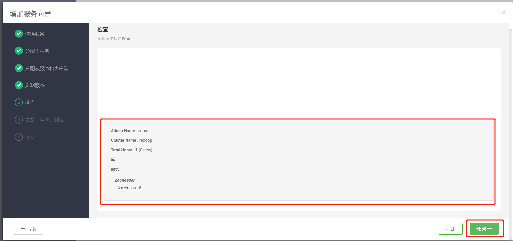
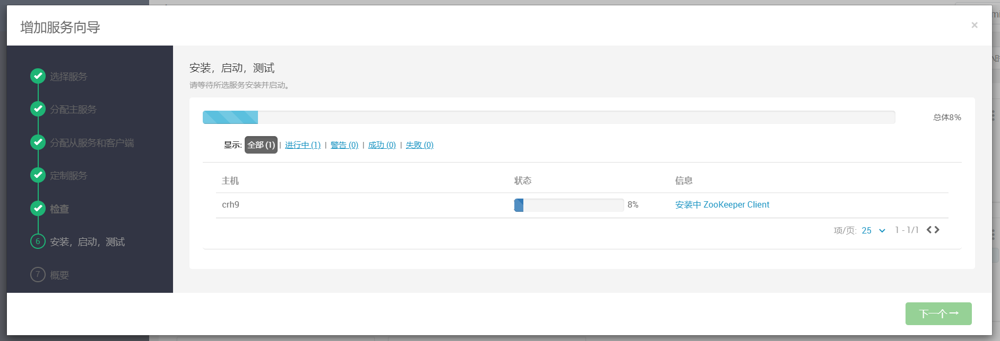
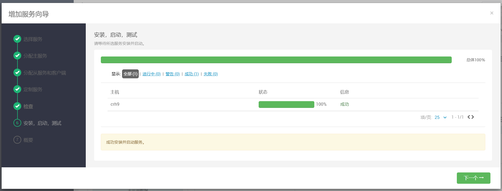

# 部署zookeeper

## 1 添加zookeeper服务

点击添加服务

在弹出列表中可以找到zookeeper组件，勾选

## 2 分配主服务

分配主服务，将主服务组件分配给要运行它们的主机。

## 3 分配从服务和客户端

将从服务和客户端组件分配给您要运行它们的主机。
显示分配主组件的主机显示*✵*. 即将安装
"客户端" ZooKeeper Client

## 4 配置参数

用户可以根据自己的需求配置具体参数，下一步

## 5 确认配置并一键部署

检查配置无误后，点击部署

## 6 部署完成

下一步，等待部署完成

在主面板可以查看组件的状态，可对该组件进行修改、维护等操作
