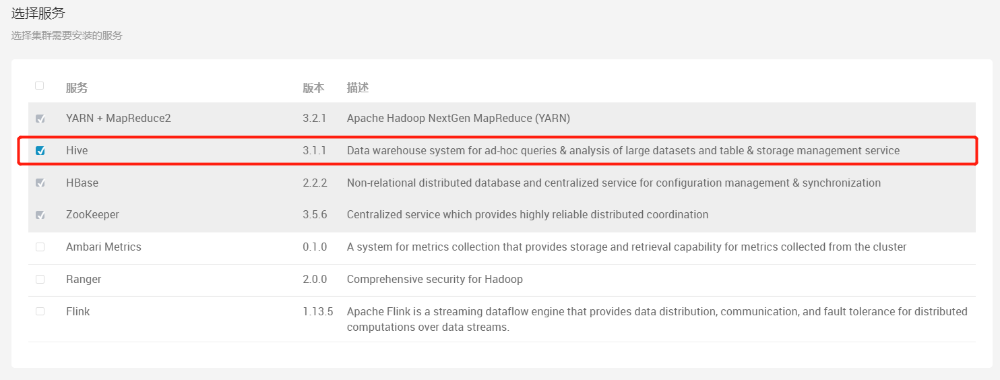
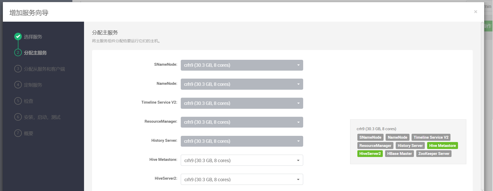
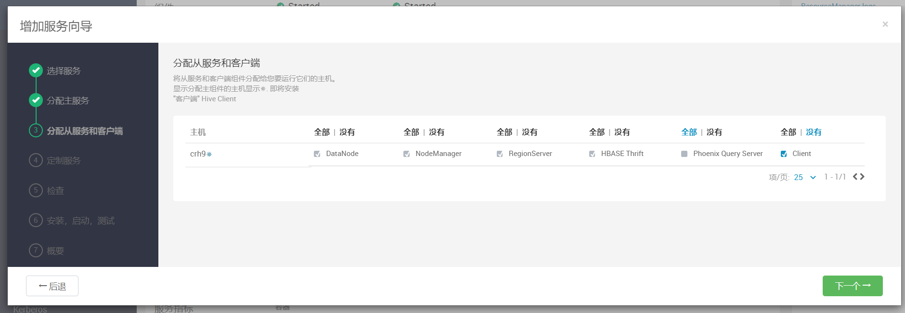
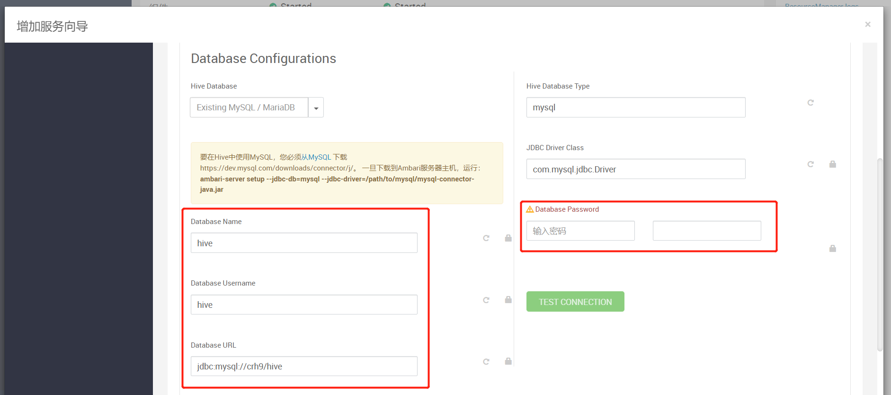
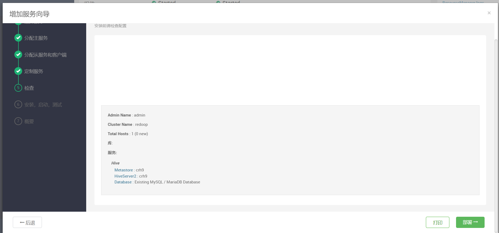
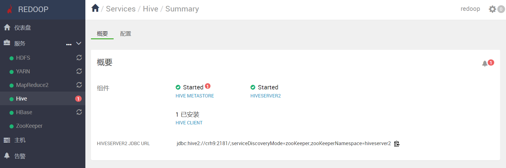

# 部署HIVE组件


## 1 添加hive服务

点击添加服务


在弹出列表中可以找到hive组件，勾选



## 2 分配主服务

将主服务组件分配给要运行它们的主机。




## 3 分配从服务和客户端

将从服务和客户端组件分配给您要运行它们的主机。
显示分配主组件的主机显示*✵*. 即将安装
"客户端" Hive Client




## 4 定制服务

我们已经为您选择的服务提供了推荐配置，请根据需要定制它们.

如果使用mysql作为源数据库，需要进行配置



注意：

```shell
要在Hive中使用MySQL，您必须从MySQL 下载https://dev.mysql.com/downloads/connector/j/

一旦下载到Ambari服务器主机，运行：
ambari-server setup --jdbc-db=mysql --jdbc-driver=/path/to/mysql/mysql-connector-java.jar
```


## 5 确认部署

确认配置后点击部署



## 6 完成部署


等待部署完成即可，我们可以在主面板维护该组件



