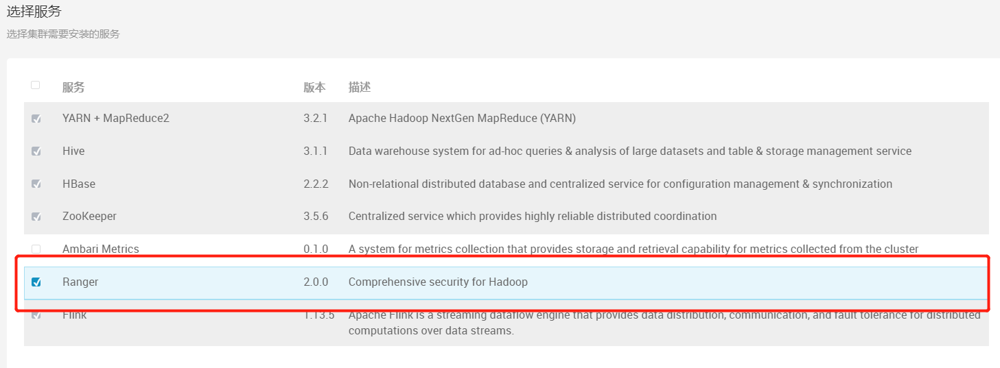
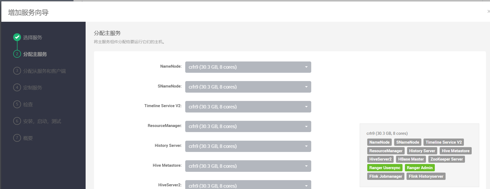
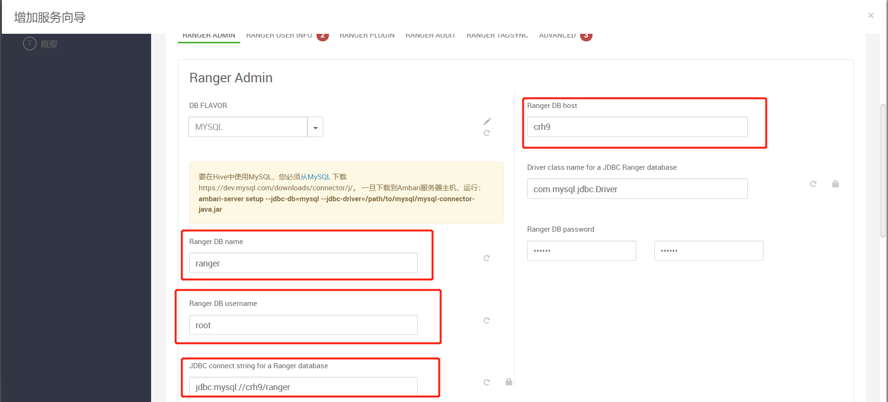
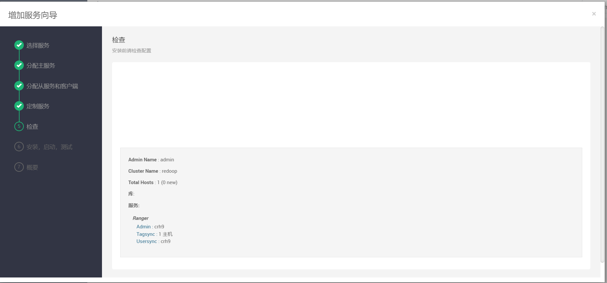
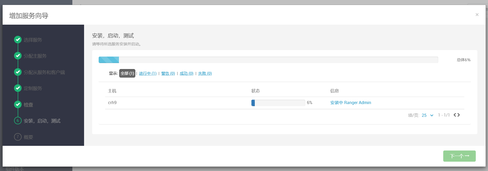
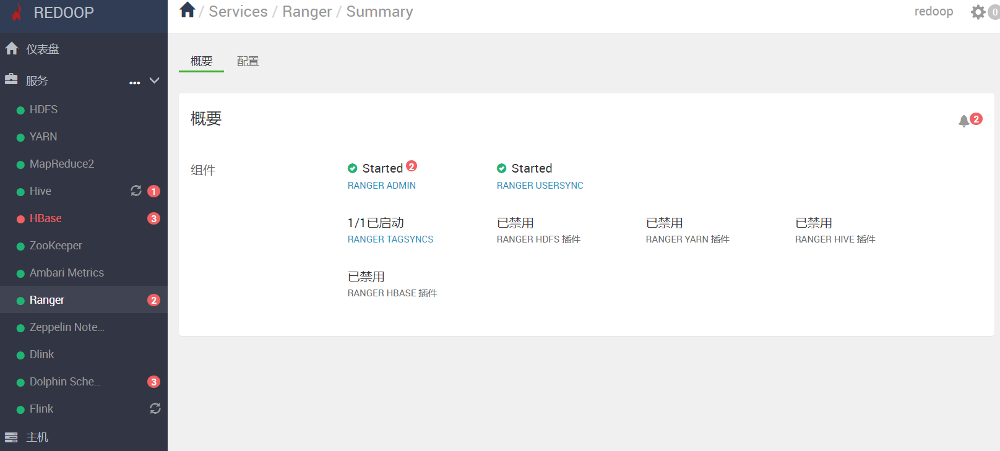

# 部署Ranger组件

## 1 添加ranger服务

点击添加服务

在弹出列表中可以找到ranger组件，勾选

## 2 分配主服务

将主服务组件分配给要运行它们的主机。

## 3 分配从服务和客户端

将从服务和客户端组件分配给您要运行它们的主机。
显示分配主组件的主机显示*✵*.

## 4 定制服务

我们已经为您选择的服务提供了推荐配置，请根据需要定制它们.

## 5 确认部署

确认配置后点击部署

## 6 完成部署

等待部署完成即可，我们可以在主面板维护该组件

